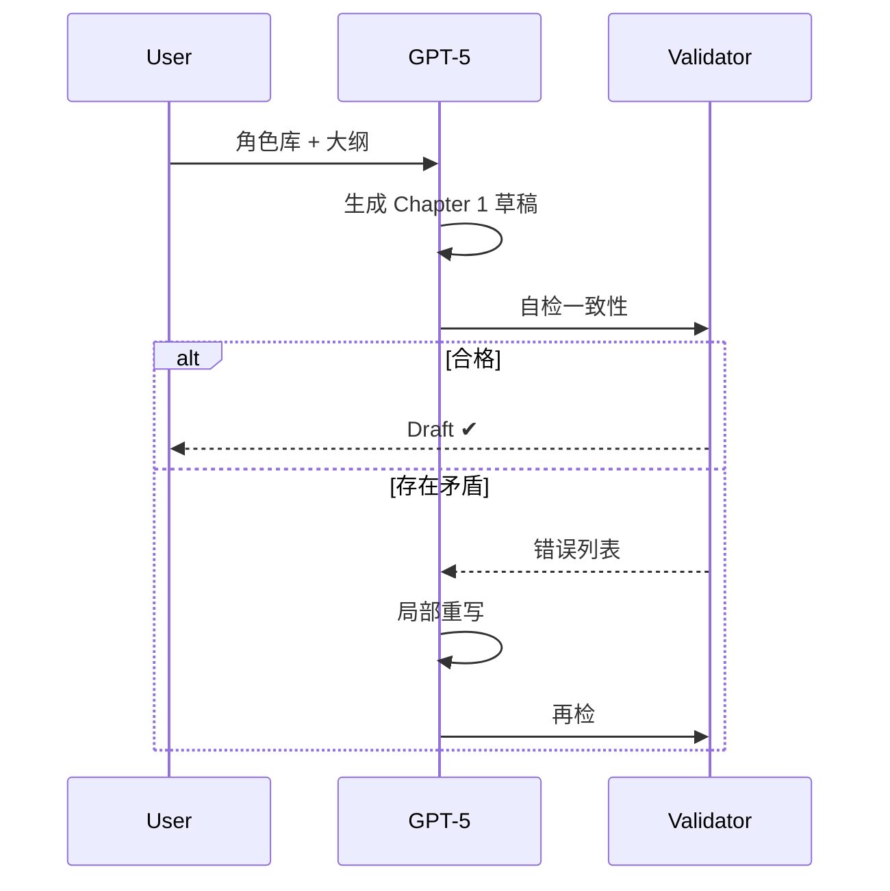

# GPT-5 处理复杂剧情的局限、常见失误与规避方案

---

## 1. 可能出现的问题

- **逻辑断裂**  
  角色忽然忘记动机、时间线跳跃、设定打架。

- **自我矛盾**  
  前后台词不符、道具凭空出现或消失、世界规则被推翻。

- **主题漂移**  
  章节风格、情绪基调或价值观突然变调，读者体验割裂。

- **重复啰嗦**  
  为了凑字数而循环同义句、情节“踩刹车”。

- **伏笔丢失**  
  早期埋线未回收，或者回收方式与原伏笔不吻合。

---

## 2. 技术与认知根因

| 根因 | 描述 |
|------|------|
| 记忆窗口有限 | 超长文本需分批生成，跨窗口信息易被遗忘。 |
| 温度与采样策略 | 创意度↑时随机性↑，连贯度易掉线。 |
| 内部推理噪声 | 大模型本质是概率分布采样，细节易漂移。 |
| 世界状态不持久 | 未显式记录角色与设定，生成时只能“猜”。 |

---

## 3. 模型层自带的缓解机制

1. **动态角色档案**  
   每位角色实时更新 `goal / flaw / status` 字典，写回下一段 prompt。  

2. **设定校验器**  
   生成后即运行规则脚本：时间顺序、地理坐标、魔法硬规则等。  

3. **自反检验循环**  
   第一次草稿 → 内部提问“是否矛盾？”→ 若“是”，重写相关段落。  

4. **重复惩罚调参**  
   使用 `presence_penalty`、`frequency_penalty` 抑制复读症。

---

## 4. 用户侧最佳实践

### 4.1 结构化资料库

- 剧情时间轴（CSV）  
- 角色蓝图（JSON）  
- 世界观百科（Markdown or YAML）

> 每次续写都把关键字段嵌入 prompt，形成“圣经”。

### 4.2 分层生成策略

1. 先写卷级大纲  
2. 再写章级精要  
3. 最后逐段落展开  
4. 各层之间跑一致性校验脚本

### 4.3 自动单元测试

- 正则或 AST 检查：人名拼写、日期跨度、地点连续性  
- 主题相似度：BERT 余弦≥0.9 为“基调一致”  
- 张力曲线对比：偏差>±10 触发重写

---

## 5. 典型工作流范例

---

## 6. 当仍出现矛盾时怎么办

| 情况 | 快速补救 |
|------|----------|
| 时间线混乱 | 输出事件列表→手动排序→让模型按新顺序重写串联句 |
| 性格走样 | 把角色 flaw/arc 明示回 prompt，再生成同场景对话 |
| 设定冲突 | 用“作者旁白”方式修正：增补原因或限制条件 |

---

## 7. 小结

GPT-5 已大幅提升长程记忆与推理，但**概率模型天生会波动**。  
守护连贯性的秘诀并非“无限窗口”，而是“结构显式化 + 自动校验 + 分层写作”。  
让模型当创造引擎，让脚本和校验规则当守门人，你就能把宏大世界写得严丝合缝，又不失灵魂。  

准备好试一次“脚本+校验”双保险流程吗？把你的角色表扔过来，我带你走一遭！ 🚀