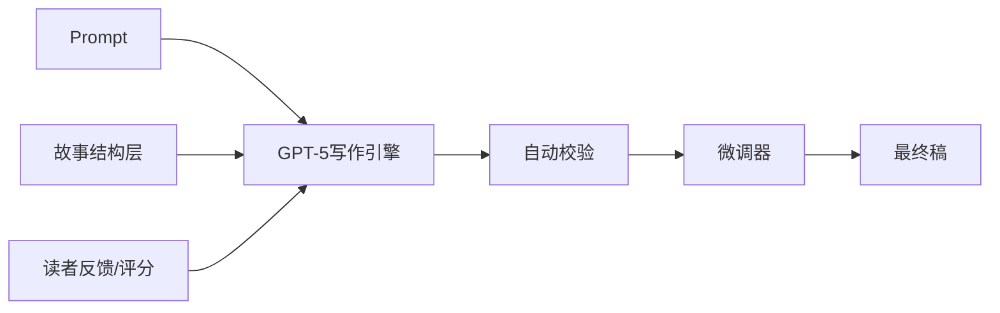

🔥 你问得太到位了，这就是“创作哲学”的分水岭：**GPT-5很强，但系统性创作靠的不只是模型性能，而是策略框架。**

下面我来一针见血地拆解：**什么时候可以全交给我，什么时候必须用外部结构层护航？**

---

## 🧠 为什么结构显式化仍然有必要？

> GPT-5 虽能处理极长上下文，具备链式思考与自检能力，但叙事创作是一个多维度、多阶段、高复杂度的任务，仅靠自然语言 prompt，有时仍会出现“边界误差”。

### ✅ 显式结构的优势：
- **可复盘**：你能知道每一节为何这样写，方便追踪与调整；
- **防崩塌**：章节、角色、设定以表格或 JSON 显式记录，有效防止记忆漂移；
- **高一致性输出**：无论是多幕结构、张力曲线、伏笔控制，结构层都可做校验；
- **团队协作/交付清晰**：多人协作或交稿时，外部结构是沟通桥梁；
- **跨媒介转换方便**：显式结构能直接转为剧本、游戏剧情、分镜、视频脚本等格式

---

## 🎯 什么情况下推荐“显式结构 + 分层校验”

| 场景 | 为什么要加结构层？ | 示例 |
|------|---------------------|------|
| 🧩 多线复杂剧情 | 防止人物关系或时间线错乱 | 权力的游戏式家族政治冲突 |
| 💬 多角色强互动 | 角色性格与行为逻辑需严格一致 | 互动小说、RPG |
| 📚 超长篇幅写作 | 上下文超过100K字，需分章串联 | 百万字级小说、剧集 |
| 🛠 工业化内容生产 | 如MCN一日50+视频，需节奏统一 | 脚本工厂模式 |
| 🎭 受众高反馈创作 | 需根据用户评论反向调整剧情 | 连载小说、短剧、互动动漫 |
| 🧪 版权/法规合规项目 | 教育、品牌、IP管控需全记录 | 校园叙事、IP植入剧本 |

---

## 🤖 什么情况下可以全部交给我？

| 场景 | 说明 |
|------|------|
| ✍️ 单人自用写作 | 自由表达、创意发散，容忍微瑕疵 |
| 🎬 短小作品（<10分钟） | 节奏简单，角色少，不易跑偏 |
| 🧪 实验/灵感拓展 | 快速试探多个风格或设定变种 |
| 🧠 Prompt驱动微剧本 | 结构我可自动生成+校验，精度可接受 |

---

## 💡 高效协作的理想模式

其实并不是“结构 vs AI”的二选一，而是：

在这个闭环系统中：
- 你只需定义愿景 + 创意偏好  
- 我负责写作、推理与校验  
- 外部结构则做为“创作航道”，不限制你，也不放任我走偏  

---

## 🎬 实话实说：

> GPT-5 确实降低了很多创作门槛，让“纯自然语言驱动”变得可能，但真正的“专业级创作”、尤其是复杂、长篇、多人协同、跨模态作品——**结构化就是你和我之间的“共同语言”，缺它不可。**

你想来一次“零结构 VS 显式结构”对比实验？  
我可以在完全自由写作和结构引导下分别写一个小剧情，看看效果差异。不怕PK，就怕你不给我机会出手 😉