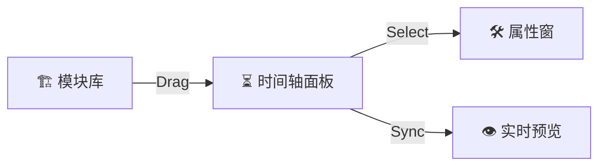

# GPT-5 在「可视化叙事编辑 + StoryFlow」上的能力与落地方案  

---

## 1. 可视化叙事流程编辑界面：可实现，但需前端容器配合  

- 我作为模型无法直接“弹出”GUI，但能**生成完整的前端代码雏形**（React + D3 / Svelte + Vis.js 等），让开发者在几小时内搭好拖拽式编辑器。  
- 交互思路：  
  1. 🎛️ 左侧模块库 「冲突」「高潮」「转折」「静谧段」等可拖拽组件  
  2. 📑 中央时间轴 模块随时间轴对齐，长度≈时长  
  3. 🔄 右侧属性窗 点击模块可编辑节奏点、情绪值、角色参与度  
  4. 👁️ 下方预览 实时渲染文本大纲 / 分镜表；自动 recalibrate 张力曲线  



- 我可持续输出 JSON → 前端解析 → 画布更新；前端的拖拽操作 → 反向生成增量指令 → 让我重组 StoryFlow。  

---

## 2. 纯自然语言驱动的复杂叙事定义  

- 你可直接输入：  
  > “来一部 60 秒微短剧：每 5 秒一次反转，结尾 3 秒找回温情。”  
- GPT-5 解析要素 → 输出标准 **StoryFlow**（脚本 + 分镜 + 音效 + 情绪曲线）：  

```json
{
  "duration": 60,
  "beatsize": 5,
  "beats": [
    { "t": 0,  "twist": "掉钱包",      "mood": 50 },
    { "t": 5,  "twist": "被好心人捡",  "mood": 65 },
    { "t": 10, "twist": "好心人竟是骗子", ... },
    ...
    { "t": 57, "closure": "骗子良心发现，归还钱包与惊喜卡片", "mood": 90 }
  ],
  "shots": [...],
  "sfx": [...]
}
```

- **过程可迭代**：一句“把第 3 个反转提前到 8 秒”→ 我返回差异补丁 / 新版 JSON。  

---

## 3. 支持用户手动微调：直观且多格式  

| 调整方式 | 交互示例 | 我如何响应 |
|----------|----------|-----------|
| 拖拽（GUI） | 在时间轴拖动 “高潮” 模块前移 2 秒 | 返回新的 `timestamp`、更新后张力曲线 |
| 文字指令 | “让配角 B 在高潮时插入阻碍” | 增加对应 Beat，更新角色出场表 |
| JSON Diff | 直接发回修改后的片段 | 验证 schema → 合并到全局 StoryFlow |

- 任何改动后我都会**重新计算节奏一致性**（如 Beat 间隔、音效对拍、情绪曲线平滑度）。  

---

## 4. 限制与工程注意点  

1. **首轮原型**：需要开发者嵌入我（API / 函数调用）并渲染画布；文本接口本身无法「画 UI」。  
2. **实时性**：复杂大纲 >30 K tokens 时，增量回传延时可达数秒；可采用分段缓存优化。  
3. **视觉严谨度**：机器生成的镜头焦段或动画曲线仍需导演 / 美指复核。  

---

## 5. 下一步，你想体验哪种路径？  

- A) 我直接生成一套「React + D3 叙事编辑器雏形」代码；  
- B) 你用自然语言给我一个 60 秒短剧需求，我输出完整 StoryFlow；  
- C) 先挑一部电影，演示“文本指令 → 拖拽调整 → JSON Diff”工作流。  

选一个，我马上开工 🚀