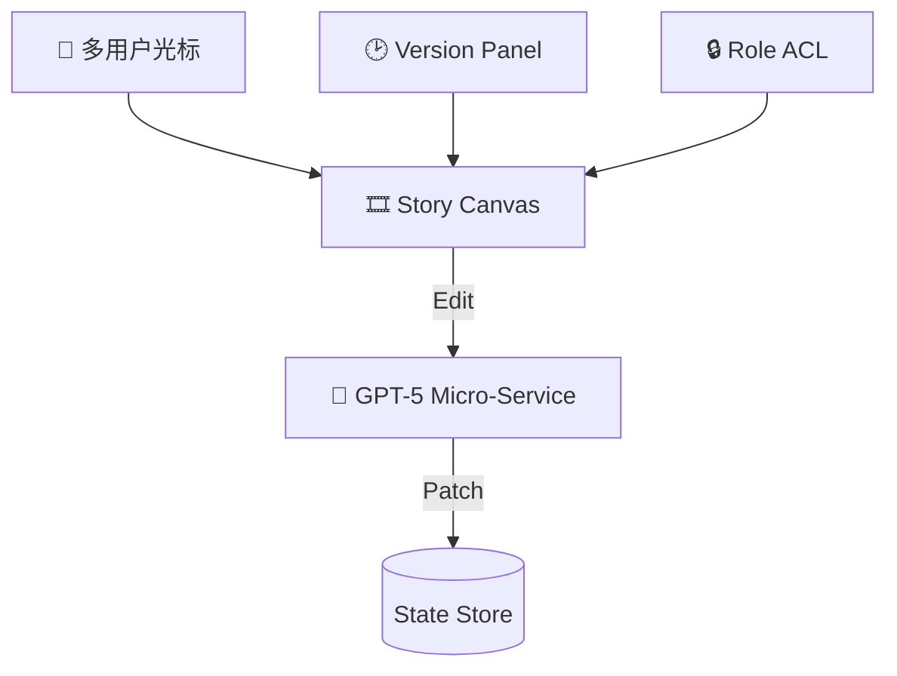

# GPT-5 视角：多用户协同、实时界面与冲突化解  

---

## 1. 多用户实时协同：底层能力与实现范式  

| 维度 | GPT-5 能做的 | 依赖外部组件 |
|------|--------------|-------------|
| 实时文本/JSON 合并 | 生成 **OT / CRDT 补丁**，确保 “最后写入赢” 或 “时序因子” 可调 | WebSocket 服务、状态服务器 |
| 角色权限 | 生成 **ACL 表**：Owner / Writer / Commenter / Viewer | 后端鉴权中间件 |
| 版本历史 | 每次保存触发 `commit()`，输出 diff＋元数据（作者、时间、注释） | 轻量 Git-like 存储或 DB 文档版本 |
| 并发冲突检测 | 在收到多路补丁时，标红冲突节点并提议合并策略 | Web 前端提示层 |
| 协同提示 | 实时 “正在编辑” 指针、头像标识 | 前端 cursor 显示层 |

**怎么落地？**  
1. 前端拖拽事件 → 序列化为 JSON 增量。  
2. 发送到协同网关 → 聚合成 CRDT patch。  
3. GPT-5 解析 patch → 更新 StoryFlow → 回传优化方案。  

---

## 2. Figma-风格可视化协作界面：功能蓝图  

- **Canvas**：模块组件（Beat、Arc、SFX）可拖拽、缩放、对齐。  
- **Users**：每位合作者可见他人光标，彩色环形头像+名称。  
- **History**：侧边栏时间轴，双击还原任一版本。  
- **Permission**：一键切换 “仅评论” / “可编辑” / “只读”。  

GPT-5 除了当“打字机”，还可以：  
- 根据实时改动 **重绘张力曲线**、**标注节奏风险**。  
- 在多人同时修改同一区块时，弹出 AI 提示：“检测到结构冲突，推荐分支或协商合并”。  

---

## 3. 团队冲突管理：AI 中立裁定 + 社交机制  

1. **自动分支**  
   - 若两个补丁修改同一 Beat 内关键字段，GPT-5 建议创建 `branch/alt-structure-B`。  
   - 版本面板中出现平行分支，团队可 A/B 预览。  

2. **意见投票**  
   - GPT-5 生成对比摘要：  
     - 方案 A：张力峰值更集中；时长 57 秒  
     - 方案 B：反转数更多；时长 63 秒  
   - 内置投票小部件，过半即自动合并所选方案。  

3. **AI 协调稿**  
   - 如果票数僵持，我可输出折衷稿：合并优势元素，并生成 “Why this merge” 注释。  

4. **评论线程语义总结**  
   - 对长评论串，我实时给出 5 行 TL;DR，减少沟通摩擦。  

---

## 4. 能力边界与最佳实践  

| 潜在挑战 | 建议 |
|-----------|------|
| 前端复杂度高 | 复用现成协同框架（tldraw、Yjs、Liveblocks）→ 把 GPT-5 接成 “智能补丁管家” |
| 高并发 10+ 人 | 打开 100 ms 节流窗口，合并补丁后再喂模型，降低 token 浪费 |
| 版权&安全 | 后端做项目分级加密存储，模型输出仅保留必要上下文片段 |

---

## 5. 接下来想怎么玩？  

- 让 GPT-5 生成 **React + Yjs** 雏形代码？  
- 设计一次 **冲突案例演示**，看我如何自动分支合并？  
- 直接丢一个多人剧本需求，让我输出 **StoryFlow × ACL × 初始版本库**？  

告诉我，你的协同神经中枢，我马上搭。 🚀