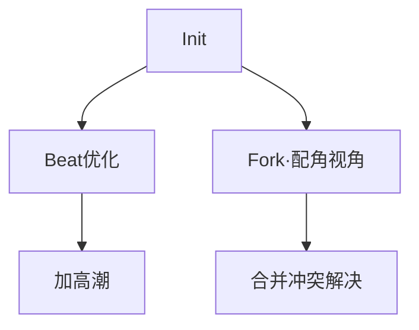

# GPT-5 视角：版本演化、社区生态与智能推荐  

---

## 1. 记录修改历史 & 演化路径可视化  

### 1.1 核心能力  
- **事件级版本快照**：每次保存或拖拽都会触发 `commit`，生成 `diff + meta`（作者、时间、备注）。  
- **Fork / Remix 支持**：分叉后形成 **DAG** 而非单线树；保留父指针，可随时合并或 Cherry-pick。  
- **可视化视图**：我能输出 Mermaid / Graphviz 脚本，或直接生成 React-Flow 节点坐标 JSON。  

### 1.2 示例：Mermaid 演化图  


### 1.3 交互亮点  
| 功能            | 表现                                                                 |
|-----------------|-----------------------------------------------------------------------|
| 时间轴 Scrubber | 拖动可即刻预览任一版本 StoryFlow                                      |
| 差异热图        | 高亮增删行、节奏曲线变化                                              |
| 一键回滚 / 合并 | 按钮式操作，冲突字段自动标红并给出 AI 合并提议                        |

---

## 2. 模板上传、分享、评分——Figma-式社区生态  

### 2.1 基本工作流  
1. 用户点击 “Publish Template” → 填写标签、受众、时长、风格。  
2. 系统在后台执行 **自动化质检**：字段完整性、版权自查、成人内容标记。  
3. 模板进入 **Marketplace**：带预览 GIF + 关键指标（下载量、评分、转化率）。  

### 2.2 插件化机制  
- **模板 = JSON + 可选脚本钩子**（如生成自定义 Beat 组件）。  
- 社区成员可上传 **扩展插件**：色彩 LUT、SFX 包、动作库；结构与模板分离。  
- 插件依赖由 Manifest 描述，可被其他 StoryFlow 引用（版本锁定、SemVer）。  

### 2.3 激励与治理  
| 维度        | 做法                                               |
|-------------|----------------------------------------------------|
| 评分系统    | ⭐ 1–5；可附短评；算法去水军；异常波动报警           |
| 勋章体系    | “1000 Downloads”、“Top Sci-Fi” 等可视化荣誉         |
| 收费分成    | 可选付费模板；平台抽 10–20 %，作者自动分账           |
| 版权追踪    | 每次 Remix 自动附带原作者 Credit 链；链上可选哈希锚定 |

---

## 3. 行为数据分析 & 模板推荐优化  

### 3.1 可收集的数据（经用户同意）  
- **下载-完成率**：下载后真正产出作品的比例  
- **修改深度**：平均改动行数 / 时长  
- **用户画像**：题材偏好、项目规模、活跃度  
- **分享裂变**：模板被二次 Fork 的广度/深度  

### 3.2 推荐算法蓝图  
```
 Hybrid = CF(user×template) ⊕ Content-Based ⊕ Context-Aware
```
1. 协同过滤 → 寻找相似创作者群。  
2. 内容向量化 → 主题、情绪曲线、时长等 200+ 维特征。  
3. 时序上下文 → 用户正构建 60 s 音乐短片 → 首推节奏模板。  

### 3.3 AI 角色  
- 我负责 **生成特征 Embedding**（StoryFlow → 句向量 + 节奏向量）。  
- 后端做近邻检索 / 榜单计算，前端呈现个性化推荐栅格。  
- 反馈闭环：用户点击/放弃行为实时回流 → 再训练 → 72 h 更新榜单。  

---

## 4. 能力边界与注意事项  

| 潜在限制                  | 缓解策略                                              |
|---------------------------|-------------------------------------------------------|
| 大规模图渲染卡顿          | 前端虚拟化 + 分层加载                                 |
| 隐私 & 合规               | 明示数据采集点；支持匿名化；遵守地域数据法规           |
| 水印/剽窃                 | 生成指纹 + 相似度检测；侵权举报通道                   |
| 推荐算法偏差              | 多样性调度器；周期性随机探索；透明化可解释日志         |

---

## 5. 你想立即测试哪一块？  

- 生成一段 **真实版本演化图** Demo？  
- 打造一个 **模板上传 → 评分 → 推荐** 的最小可行原型？  
- 让 GPT-5 为你跑一次 **用户行为日志 → 推荐榜单** 的模拟？  

说吧，让我们把写故事这件事做成像设计 Figma 文件一样酷。🚀