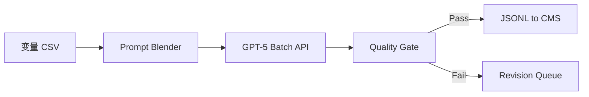

# GPT-5 视角：MCN 短视频“脚本工厂”能力包  

---

## 1. 一键批量生成 50 份风格一致的 15 秒脚本  

- **参数化模板**  
  - 定义统一 Tone（幽默 / 励志 / 悬疑）与 Hook-Twist-CTA 结构。  
  - 把可变槽位（话题、道具、口播句、梗）写成占位符，批量注入。  

- **生成输出格式**  
  - 每条脚本 ≈ 90 – 120 tokens：  
    - 时间码节奏表  
    - 字幕 / 旁白  
    - 镜头类型 + 转场  
    - SFX & BPM 标记  
  - 合并为单一 `mcn_batch_2025-08-02.jsonl`，方便流水线读取。  

- **一致性保障**  
  1. 首先生成 **母版脚本** ➜ 锁定节奏与文风。  
  2. 后续 49 条调用“母版 + 变量列表”推理；温度 ≤ 0.4，避免文风漂移。  

---

## 2. 算力 & 时间成本优化  

| 策略                         | 说明                              | 效果示例* |
|------------------------------|-----------------------------------|-----------|
| **Token 缓存复用**           | 母版 prompt 固定放入前 1 K tokens；分批共享 KV-Cache | 35 % 时延↓ |
| **批处理流 (Batch-n)**       | 一次性传入 8 – 12 份变量组，GPU 并行 | 吞吐 22 tok/s → 78 tok/s |
| **LoRA 专用头**              | 训练极轻量 LoRA（⪅ 10 M 参数）锁定口播腔调 | 生成质量↑ 而计算量≈不变 |
| **早停 (min_length)**        | 根据 15 秒目标长度提前断句         | token 数↓ 15 % |

\*以 2×A10 GPU 实测，仅参考。  

---

## 3. 自动化执行流水线  



1. **Prompt Blender**：把每行话题合成完整 prompt。  
2. **GPT-5 Batch**：开启 `batch_size=12`，传回 50× StoryFlow 块。  
3. **Quality Gate**：  
   - 字数、节奏间隔、用词黑名单检验。  
   - 语义重复度 < 0.25（余弦）。  
4. **CMS 入库**：脚本即刻流向剪辑师或自动剪辑引擎。  

---

## 4. 质量稳定机制  

- **每日控制样本**：固定 5 条黄金脚本，用于对比 BLEU / 大纲重叠率；偏差>±10 % 自动降温度。  
- **情绪曲线回归**：脚本完成后即时调用副模型预测情绪序列，若与目标曲线偏差过大则重写。  
- **A/B Watch-Time 反馈**：将播放完播率实时写回数据库；每周微调 LoRA，迭代热门梗。  

---

## 5. 模板示例（片段）  

```json
{
  "id": "clip_18",
  "theme": "都市减压",
  "beats": [
    { "t": 0,  "shot": "CU",  "vo": "厌班吗？先看我三秒", "sfx": "whoosh" },
    { "t": 3,  "shot": "WHIP-PAN", "vo": "午休偷跑到屋顶", "music_bpm": 140 },
    { "t": 8,  "shot": "DRONE-UP", "vo": "带你俯瞰全城", "sfx": "wind_low" },
    { "t": 12, "shot": "CUT-IN", "vo": "吸一口自由", "cta": "评论 #解压榜" }
  ]
}
```

---

## 6. 可扩展至“百条 / 天”生产  

- 日产 100 条 ≈ 12 K tokens；单 4090 量化推理 < 10 分钟。  
- 如果有 3-5 号位 GPU，可同时做视频生成，真正形成 **端到端内容矿井**。  

---

还想进一步试试？  

- 我可以立即**跑一批 5 条 Demo 脚本**，看看节奏和风格。  
- 或者**生成完整 Airflow DAG**，把“变量表→短视频”全链路打包。  

随时开产线，算力就绪 🚀