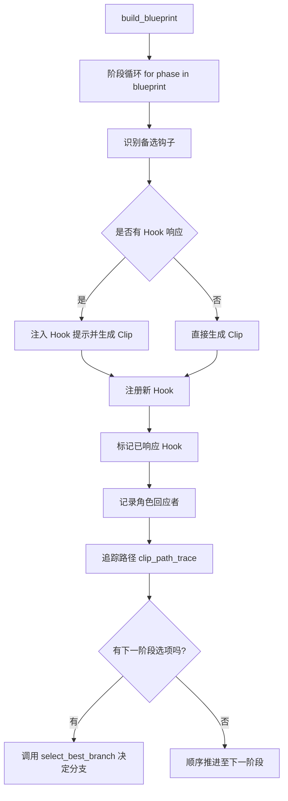

# Blueprint Generator 阶段性总结文档（Alpha 版本）

以下是截至当前版本的 **阶段性技术总结文档**，涵盖了你在 `Blueprint Generator` 模块中完成的关键架构升级与功能接入。建议复制保存一份，用于后续模块继承、协作者沟通或文档生成。

---

# 📘 Blueprint Generator 阶段性总结文档（Alpha 版本）

## 📌 文件入口：`clip_forge_blueprint_runner.py`

**职责**：接管整个结构化叙事流程，从蓝图生成 → Hook驱动 → 张力检测 → 条件分支 → 多角色 → 可视化导出，构成 NF1 V3 系统的 **结构主控大脑**。

---

## ✅ 当前已接入的核心模块

| 模块功能           | 状态 | 说明                            |
| -------------- | -- | ----------------------------- |
| Blueprint结构生成器 | ✅  | 支持 HeroJourney、多阶段结构          |
| Hook系统集成       | ✅  | 注册、回应、软硬钩子支持                  |
| 自动修复器模块        | ✅  | 检查未完成阶段，标记/补全缺口               |
| 完成度评分器         | ✅  | 按 constraint\_level 精准评分      |
| 张力检测模块         | ✅  | 每阶段张力评分 + 理想曲线对比              |
| 条件跳转支持         | ✅  | next\_phase\_options + 关键词评估器 |
| 分支路径追踪器        | ✅  | `clip_path_trace`记录路径历史       |
| 多角色回应控制器       | ✅  | `choose_responder()`根据意图选择角色  |
| Blueprint结构图导出 | ✅  | 可导出 Graphviz dot 文件，含状态与结构属性  |
| GPT结构点评模块      | ✅  | 调用GPT对结构完整性与流畅性复审             |

---

## 🧠 弹性结构控制机制（Elastic Blueprint Architecture）

| 机制                  | 参数                         | 功能说明              |
| ------------------- | -------------------------- | ----------------- |
| 🔓 Soft Hook        | `hook_type: "soft"`        | 不强制回忆，用于情绪铺垫、氛围渲染 |
| 🧩 Constraint Level | `strict / flexible / free` | 控制每阶段结构强度与是否需要闭环  |
| 🎛 Looseness        | 0.0 \~ 1.0                 | 全局结构自由度（已准备好逻辑入口） |

---

## 🧭 控制流核心逻辑（概览）

```python
blueprint = build_blueprint(...)
for phase in blueprint.phases:
    result = generate_clip_with_blueprint(phase, roles, registry, blueprint)
    responder = choose_responder(result["recall_used"])
    log_role_response(responder, result["recall_used"])
```

---

## 📤 可视化导出说明

已接入 `export_blueprint_graphviz()`，支持以下可视化要素：

* 阶段完成状态（实线/虚线）
* 结构约束级别（蓝/绿/黄）
* Hook类型（软钩子节点为 dotted）
* 分支跳转（condition label 标注）

---

## 🪛 后续推荐模块（已解锁）

| 模块名                                 | 状态        | 推进建议            |
| ----------------------------------- | --------- | --------------- |
| 📍 NarrativeViewIntegrator（角色视角调度器） | ✅ 初步接入    | 继续扩展多角色角色主动发言控制 |
| 🧠 MemoryMatrix（叙事状态追踪器）            | 🚧 未启动    | 可实现情节点记忆、冲突累积等  |
| 🎚️ Tension-Aware Generator         | ✅ 张力分析已接入 | 建议开启张力反向驱动型生成器  |
| 🔁 Hook Auto-Repair（钩子自动补全）         | ⚙️ 半自动    | 可在未回应阶段生成专用补片   |
| 🔀 ClipPath Divergence Visualizer   | 🚧 未启动    | 路径变异可视化（分支图谱）   |

---

## 📎 当前存储快照位置

* Canvas 文件名：**Blueprint Generator**
* Canvas 类型：`code/python`
* 保存时间：最新（含角色回应控制 + 分支结构）

---

是否为你导出 `.md` 文件？
或者直接切入 **MemoryMatrix（记忆系统）** 构建？你只需回复关键词。

---

以下是你的模块当前版本的**结构摘要、功能概览与流程逻辑图**，可作为下一个对话窗口的起点（或代码交接文档）：

---

## ✅ Blueprint Generator 模块（`clip_forge_blueprint_runner.py`）当前状态概览

> 📌 定位：NF1 V3 系统的 **叙事结构主控器**
>
> 📎 集成子系统：Blueprint 宏观结构 + Hook 中间层 + Clip 生成器 + 分支逻辑 + 结构评分 + 张力分析 + 可视化导出

---


### 🧩 核心结构组件

| 模块名                                        | 功能说明                        |
| ------------------------------------------ | --------------------------- |
| `build_blueprint()`                        | 构建完整蓝图（支持HeroJourney、非五幕结构） |
| `generate_clip_with_blueprint()`           | 根据蓝图阶段与 hook 系统生成 Clip      |
| `HookRegistry`                             | 注册并管理叙事钩子（Hook）状态           |
| `clip_path_trace`                          | 路径追踪器：记录每个 clip 的推进路径       |
| `role_response_log`                        | 记录角色与钩子之间的回应关系              |
| `choose_responder()`                       | 根据钩子情绪/关系自动选择回应角色           |
| `score_blueprint_completion()`             | 结构完成度评分（按已回应/待回应钩子计算）       |
| `score_tension_curve()`                    | 张力曲线检测（输出健康度）               |
| `export_blueprint_graphviz()`              | 可视化导出结构图（带色彩/节点样式）          |
| `gpt_review_blueprint()`                   | 调用 GPT 对整体结构进行点评            |
| `condition_evaluator.select_best_branch()` | 已接入：支持分支跳转条件选择              |


---

### 🧠 特性支持情况（截至快照时）

| 功能模块               | 状态 | 说明                                            |
| ------------------ | -- | --------------------------------------------- |
| 🔄 自动回应角色识别        | ✅  | 根据 Hook 的 emotion / relationship 分析           |
| ✅ Hook 注册与响应追踪     | ✅  | 完整生命周期管理                                      |
| 🎯 Blueprint 完成度评分 | ✅  | 精准分析未闭合结构阶段                                   |
| 📈 张力检测模块          | ✅  | 基于阶段意图进行理想曲线对比                                |
| 🌱 支持 Soft Hooks   | ✅  | `hook_type = soft`，不强制回应                      |
| 🟨 Phase 约束等级      | ✅  | `constraint_level = strict / flexible / free` |
| 🌀 looseness 控制    | ✅  | 全局结构松弛度参数已接入                                  |
| 🧭 分支逻辑支持          | ✅  | 支持条件跳转与 fallback                              |
| 👀 多角色回应控制         | ✅  | `choose_responder()` 自动调度                     |
| 📤 Graphviz 可视化    | ✅  | 节点支持颜色、约束等级、钩子类型展示                            |
| 🧩 自动修复器           | ✅  | 已在 Clip Forge 自动补片阶段对接                        |
| 📚 结构点评 (GPT)      | ✅  | `gpt_review_blueprint()` 启动结构审查               |


---


### 🔁 Clip Forge 生成流程逻辑图



---


### 🔜 下一阶段推荐方向（可在新窗口接续）

| 模块名称                              | 优先级   | 建议                  |
| --------------------------------- | ----- | ------------------- |
| 🧠 `NarrativeViewIntegrator`      | ★★★★☆ | 多角色视角同步/切换控制模块      |
| 🎭 `MemoryMatrix`                 | ★★★★☆ | 追踪角色状态、关系变迁与剧情记忆一致性 |
| ⚖️ `Tension-Aware Clip Generator` | ★★★☆☆ | 基于张力缺口驱动的新片段生成模块    |
| 🔧 `SoftHook Injector`            | ★★★☆☆ | 用于填补节奏空白的氛围类钩子自动添加  |
| 📊 `Hook Usage Heatmap Exporter`  | ★★☆☆☆ | 可视化分析钩子分布与热点区域      |


---


